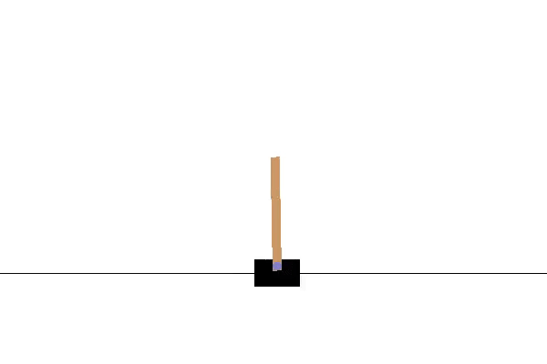

# OpenAI-Gym
This repository contains a solution to the Mountain Car Demo as well as the Cart Poll Demo from the OpenAI Gym library

## Cart Pole (V1) ##
According to OpenAI (2018a), the CartPole problem involves a pole which is attached to a cart which moves along a frictionless track. The controls of the system apply force of either +1 or -1 to the cart. The pole starts upright and should not fall over. A reward of +1 is provided each time that the pole remains upright (per step) and the episode comes to an end when the pole is no longer less than 15 degrees from its starting vertical position. In a case where the cart moves more than 2.4 units from the center, the episode is ended too.

## Mountain Car (V0) ##
According to OpenAI (2018b), the MountainCar problem is one that involves a one-dimensional track with a car that is positioned on this track, between two mountains. The goal of this problem is to get the car on top of the mountain on the right with the constraint of the car’s engine not being strong enough to successfully make the trip. Thus, the care needs to drive back and forth to build enough momentum to reach the goal.

